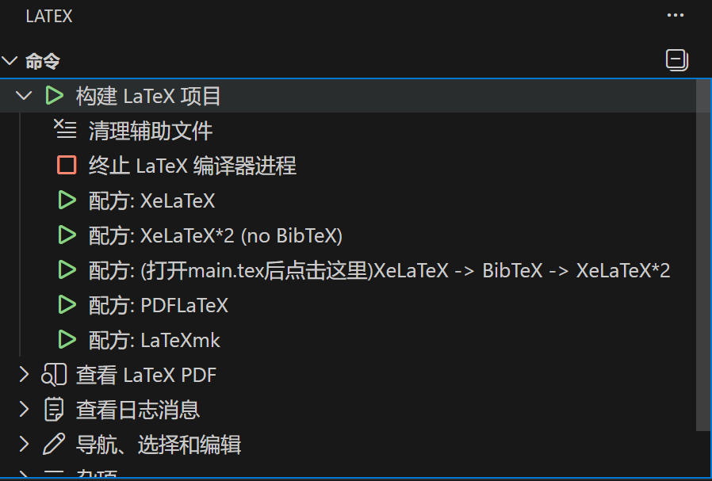

北京科技大学硕士/博士学位论文 LaTeX 模板
======================================

本仓库是 **北京科技大学硕士/博士学位论文 LaTeX 模板** 的一个整理与优化版本，
原始模板来自北京科技大学研究生院官方发布：
(2025.07.01)
- 官方下载页面：<https://gs.ustb.edu.cn/index.php/cms/item-view-id-3319.shtml>

在官方模板基础上，本版本对参考文献（BibTeX）相关配置做了小幅优化，方便快速上手与统一排版效果。

## 特点概述

- 使用自定义文档类 `ustbthesis.cls`，符合北京科技大学硕/博论文撰写格式要求。
- 已按章节拆分内容文件（`contents/chap1.tex` 等），便于逐章撰写与管理。
- 使用 `natbib` 数字型引用（`numbers, sort&compress`），支持 [1–3] 这类压缩编号格式。
- 统一 `hyperref` 链接颜色为黑色，避免 PDF 中出现彩色链接，符合论文打印需求。
- 提供示例 `refs.bib` 与参考文献章节示例，适合直接在此基础上维护文献库。

## 使用方法

### 1. 环境要求

建议安装最新版 TeX 发行版（如 TeX Live 或 MiKTeX），并确保支持 XeLaTeX 编译（推荐用于中文排版）。

vscode 可以安装tex插件：LaTeX Workshop , LaTeX


推荐的编译链（图中第三个配方）：
"name": "(打开main.tex后点击这里)XeLaTeX -> BibTeX -> XeLaTeX*2",


### 2. 基本使用流程

1. Fork后，克隆或下载本仓库：

	 ```bash
	 git clone <你的仓库地址>
	 ```

2. 打开 `main.tex`，根据个人信息修改封面区字段：作者、题目、学院、专业、学号、导师等。
3. 在 `contents/chap*.tex` 中撰写各章节正文内容。
4. 在 `refs.bib` 中维护参考文献信息，在正文中通过 `\cite{key}` 等命令进行引用。
5. 按“环境要求”中的编译链进行编译，生成 `main.pdf`。

## 目录结构说明

- `main.tex`：主文件，包含文档类声明、封面信息、章节引入及参考文献设置。
- `ustbthesis.cls`：北京科技大学学位论文文档类定义文件。
- `refs.bib`：参考文献数据库（BibTeX 文件）。
- `contents/`：各章节与附录等内容文件目录，例如：
	- `abstract.tex`：中英文摘要。
	- `preclude.tex`：序言 / 前言。
	- `chap1.tex`～`chap6.tex`：正文章节示例。
	- `appendix.tex`：附录。
	- `thanks.tex`：致谢。
	- `mresume.tex`：作者简历与在学研究成果。
	- `dataset.tex`：学位论文数据集说明。
- `images/`：图片资源目录，封面校徽等图片存放在此（如 `images/ustb.png`）。

## BibTeX 优化说明

相较于原始官方模板，本版本主要在以下方面对参考文献配置做了调整：

- 使用 `\usepackage[numbers,sort&compress]{natbib}`，支持数字型排序并自动压缩连续编号。
- 默认采用 `unsrtnat` 样式：`\bibliographystyle{unsrtnat}`，保持引用顺序与文中首次出现顺序一致，
	适合理工科类论文常用排版习惯。
- 统一 `hyperref` 链接样式为黑色，避免 PDF 中引用与链接显示为绿色或其他颜色，便于打印与阅读。

如需自定义参考文献样式，可在 `main.tex` 中修改：

```tex
\bibliographystyle{unsrtnat}
```

为其他 `.bst` 样式文件（如 `plainnat` 等），或自行编写适配学校要求的 `.bst` 文件。

## 许可证与致谢

- 本模板基于北京科技大学研究生院公开发布的 LaTeX 模板进行整理与轻量优化，
	仅用于教学、学习与个人学位论文写作使用。
- 在使用本模板撰写并提交学位论文前，请务必再次核对最新的学校/学院论文写作与排版规范，
	若有不一致之处，以学校最新官方要求为准。

如果你在使用过程中发现问题或有改进建议，欢迎提交 Issue 或 Pull Request 帮助完善模板。

